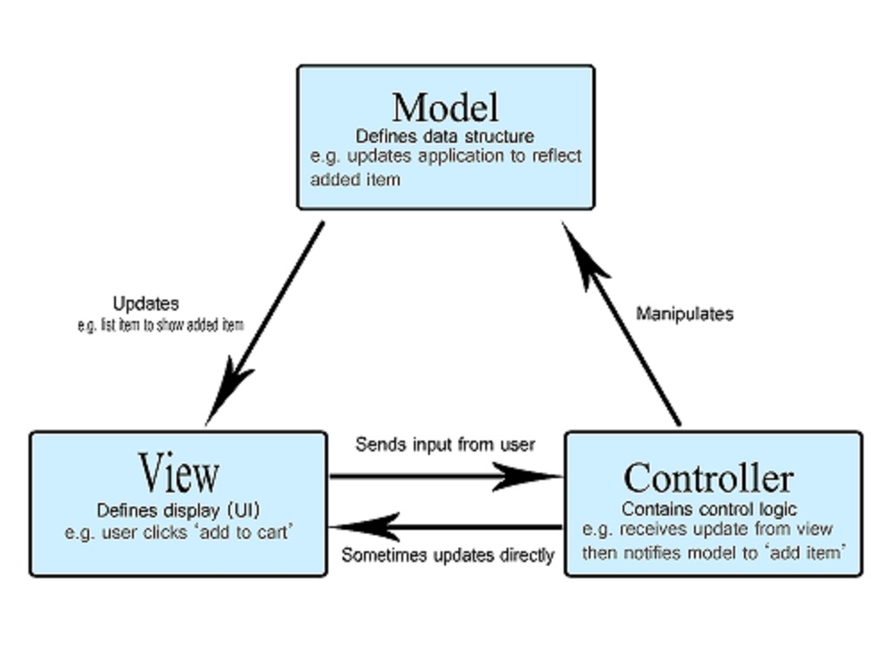
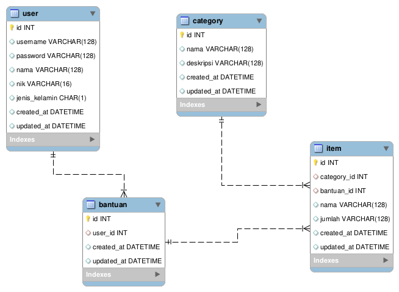

# Daftar Isi
- [Daftar Isi](#daftar-isi)
- [Identitas](#identitas)
- [Penjelasan Singkat Aplikasi](#penjelasan-singkat-aplikasi)
- [Penjelasan Fitur](#penjelasan-fitur)
  - [Register](#register)
  - [Login](#login)
  - [Tambah Bantuan](#tambah-bantuan)
    - [Tambah Item](#tambah-item)
  - [Bantuan Saya](#bantuan-saya)
    - [Filter by category](#filter-by-category)
  - [Daftar Bantuan](#daftar-bantuan)
    - [Filter by category](#filter-by-category-1)

# Identitas
Nama: Komang Yogananda Mahaputra Wisna\
NRP : 05111740000114

# Penjelasan Singkat Aplikasi
Bantuan merupakan aplikasi web pencatatan bantuan sederhana yang dibuat menggunakan framework phalcon. Fitur utama dari aplikasi bantuan adalah seseorang dapat login dan mencatatkan bantuannya di dalam sistem.

Arsitektur yang digunakan aplikasi ini adalah arsitektur MVC dengan menggunakan konsep Single Module phalcon.

Database yang digunakan adalah relational database dengan desain seperti berikut:  

# Penjelasan Fitur

## Register

## Login

## Tambah Bantuan

### Tambah Item

## Bantuan Saya

### Filter by category

## Daftar Bantuan

### Filter by category