# Daftar Isi
- [Daftar Isi](#daftar-isi)
- [Identitas](#identitas)
- [Penjelasan Singkat Aplikasi](#penjelasan-singkat-aplikasi)
- [Penjelasan Fitur](#penjelasan-fitur)
  - [Register](#register)
  - [Login](#login)
  - [Tambah Bantuan](#tambah-bantuan)
    - [Tambah Item](#tambah-item)
  - [Bantuan Saya](#bantuan-saya)
    - [Filter by category](#filter-by-category)
  - [Daftar Bantuan](#daftar-bantuan)
    - [Filter by category](#filter-by-category-1)

# Identitas
Nama: Komang Yogananda Mahaputra Wisna\
NRP : 05111740000114

# Penjelasan Singkat Aplikasi
Bantuan merupakan aplikasi web pencatatan bantuan sederhana yang dibuat menggunakan framework phalcon. Fitur utama dari aplikasi bantuan adalah seseorang dapat login dan mencatatkan bantuannya di dalam sistem.

Arsitektur yang digunakan aplikasi ini adalah arsitektur MVC dengan menggunakan konsep Single Module phalcon.

Database yang digunakan adalah relational database dengan desain seperti berikut:  

# Penjelasan Fitur

## Register
Fitur ini adalah fitur yang digunakan user untuk mendaftarkan diri pada sistem. Sistem membutuhkan data user seperti Nama, Username, Password, NIK, dan Jenis Kelamin.

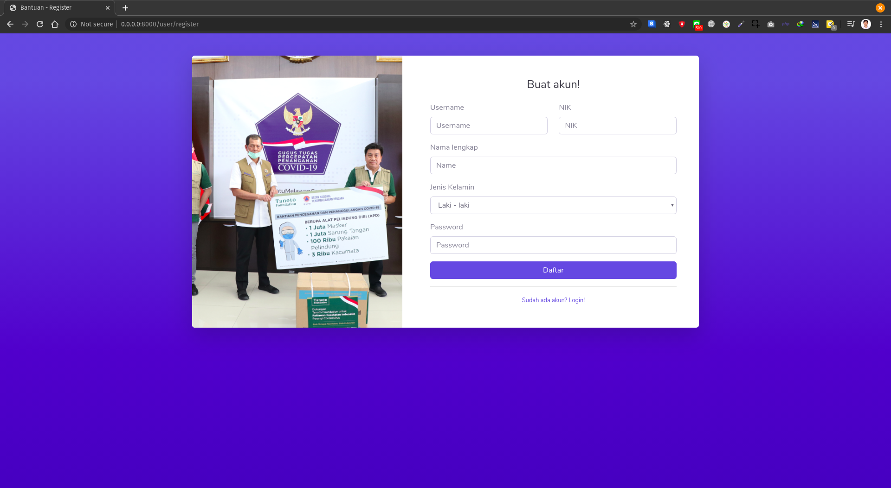

Apabila salah satu formnya tidak terisi atau tidak sesuai format, maka sistem akan menampilkan error "Terjadi Kesalahan" sebagai feedback kepada user.

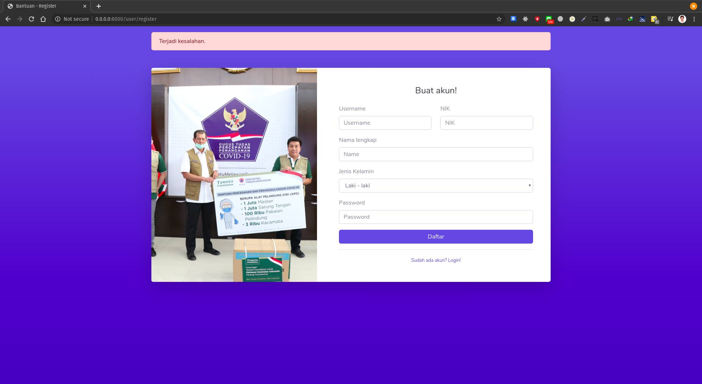

Setelah mengisi data dan menekan tombol daftar maka user akan diarahkan pada alamat login pada sistem.

## Login
Fitur ini adalah fitur yang digunakan oleh user untuk memasuki sistem dengan akun yang sudah didaftarkan sebelumnya.

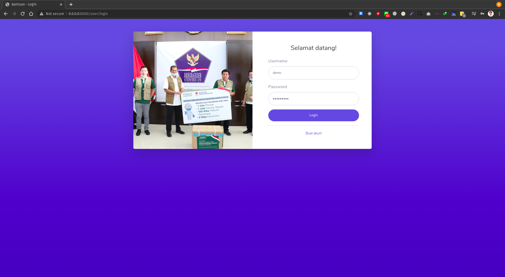

User akan berada pada dashboard apabila berhasil login melalui akun yang sudah didaftarkan sebelumnya. Apabila tidak maka akan terdapat feedback error kepada user.

Feedback Error

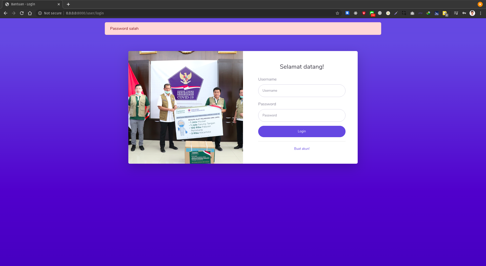

Dashboard

## Tambah Bantuan

Tambah bantuan merupakan fitur yang digunakan untuk menambahkan bantuan kedalam sistem. Halaman tambah bantuan berisi sebuah tabel yang menyatakan banyaknya item yang sudah ditambahkan.

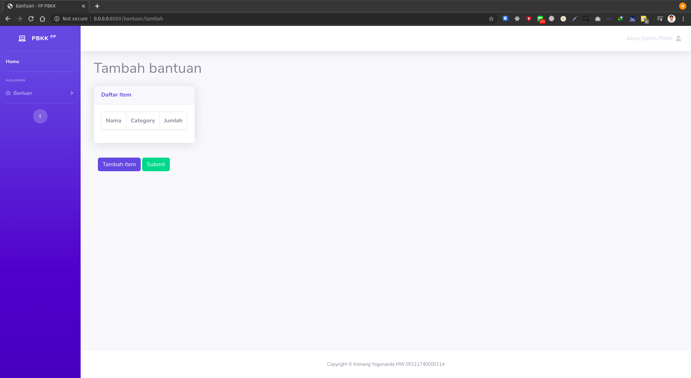
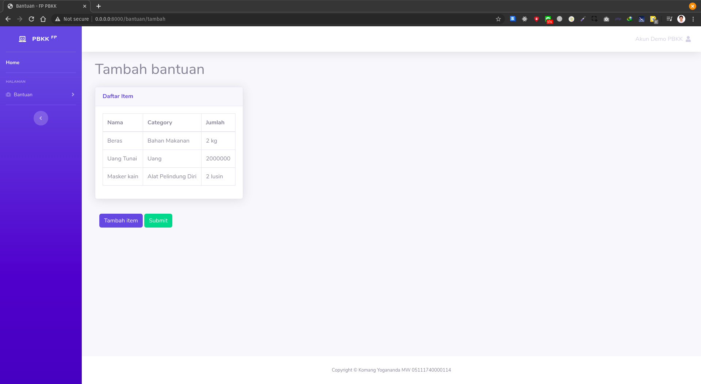
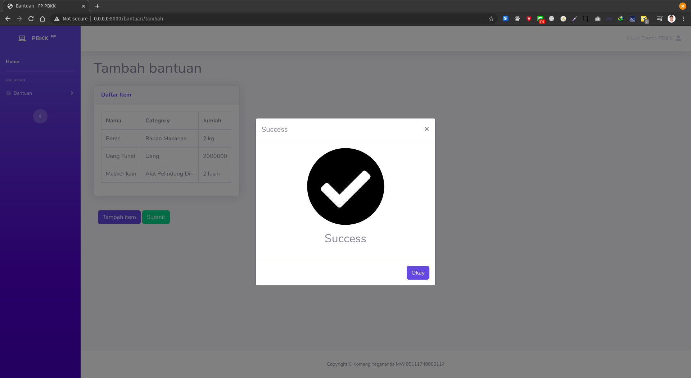

### Tambah Item
Fitur yang digunakan untuk menambah item pada setiap bantuan. Item diproses pada sistem bersamaan dengan item lainnya saat bantuan telah di submit. Item memiliki kategori yang telah ditetapkan oleh sistem.

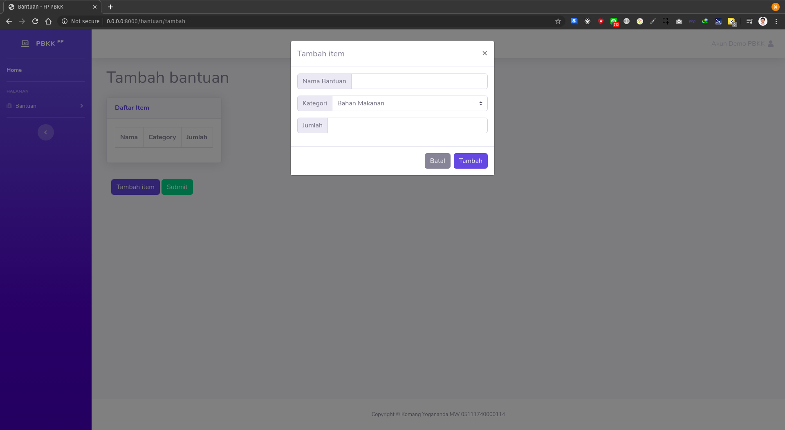

## Bantuan Saya
Fitur yang digunakan untuk melihat seluruh daftar bantuan pengguna yang telah berhasil di catat oleh sistem. Daftar terurut sesuai dengan tanggal dimasukkannya bantuan. Terdapat fitur toggle untuk melihat daftar item yang ada pada suatu bantuan. Terdapat fitur filter by category juga untuk melihat bantuan dan item - item sesuai dengan kategori tertentu.

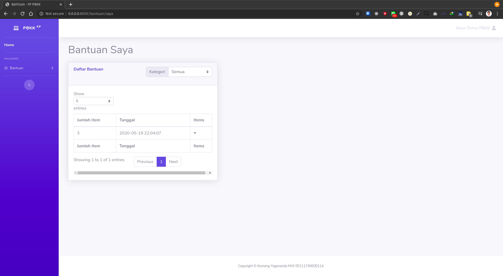

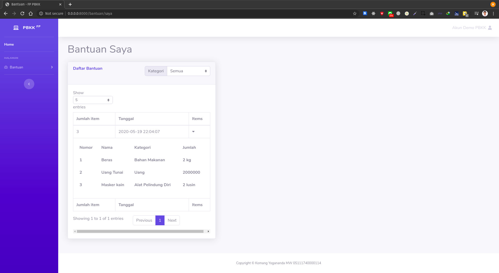

### Filter by category
Filter by category digunakan untuk menyaring item yang hanya memiliki kategori tertentu, category dikirikan dengan get params.

Contoh category Uang  
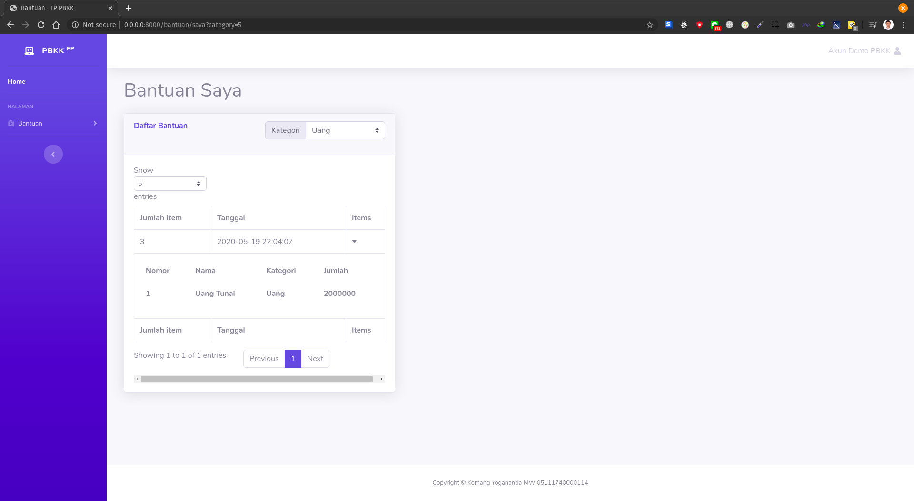  
Terlihat pada gambar bahwa bantuan yang aslinya terdapat 3 items ketika di saring hanya terdapat 1 item yang ditampilkan

Contoh category alat kesehatan
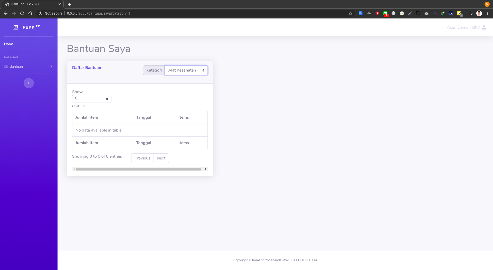
Terlihat pada bantuan yang telah saya tambahkan tadi tidak ada pada kategori alat kesehatan. Maka ketika di filter berdasarkan kategori tersebut maka hasilnya pun tidak ada.

## Daftar Bantuan
Daftar bantuan adalah fitur sama seperti bantuan saya namun untuk semua user yang telah tercatat di sistem. Perbedaannya dengan bantuan saya adalah pada halaman ini terdapat informasi nama pemberi bantuan.

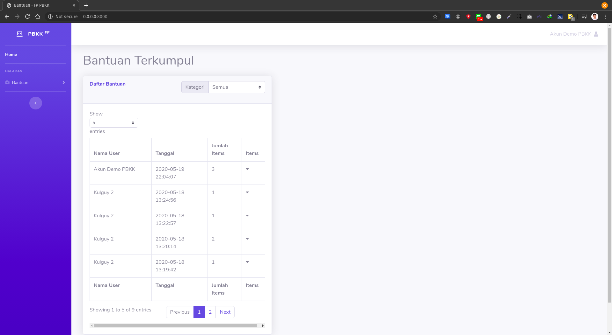

### Filter by category
Fitur ini sama halnya dengan fitur filter by category pada daftar bantuan saya. Hanya saja diaplikasikan untuk semua bantuan yang ada.

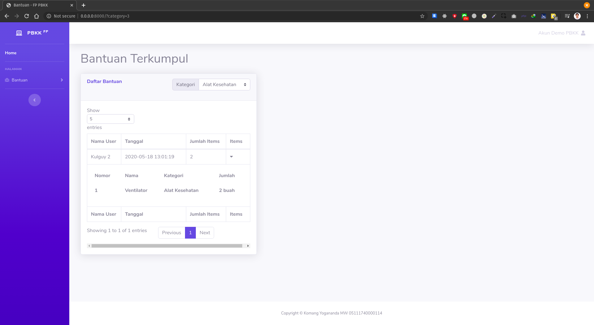

